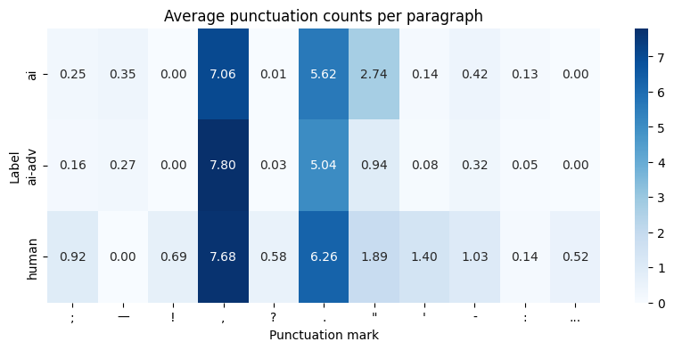
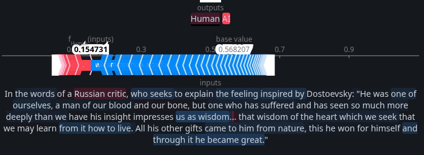
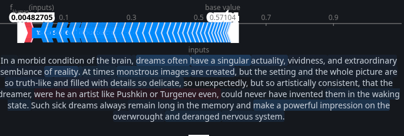
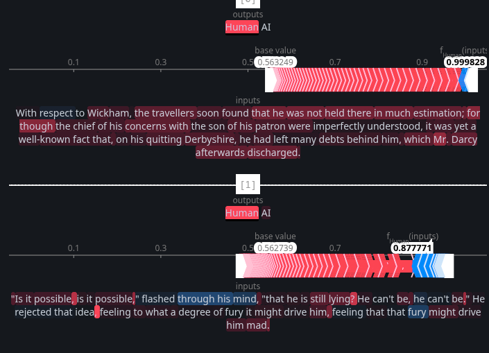

# PreCog task: The Ghost in the Machine


## Task 0

### Files
[Crime and Punishment](books/crime_and_punishment.txt)<br>
[Pride and Prejudice](books/pride_and_prejudice.txt)<br>
[Paragraphs on the same topics as Crime and Punishment](books/<br>class2_crime_and_punishment.txt)<br>
[Paragraphs on the same topics as Pride and Prejudice](books/<br>class2_pride_and_prejudice.txt)<br>
[Mimicked paragraphs, Crime and Punishment](books/class3_crime_and_punishment.txt)<br>
[Mimicked paragraphs, Pride and Prejudice](books/class3_pride_and_prejudice.txt)<br>
[Code](task-0.ipynb)

---
### Methodology

I chose Crime and Punishment, and Pride and Prejudice as my textbooks. Cleaned them up using the [gutenberg_cleaner](https://github.com/kiasar/gutenberg_cleaner) python package. Removed underscores and standardized the apostrophes. Removed illustration metadata using regex patterns for Pride and Prejudice

For extracting topics, I sent the entire book as input to gemini (200k tokens btw), and asked it to extract topics.

**Crime and Punishment**: The "Extraordinary Man" Theory, Psychological Guilt and Internal Punishment, Alienation from Humanity, Redemption through Suffering and Faith, Social Injustice and the Crushing Weight of Poverty.

**Pride and Prejudice**: Marriage and Social Security, Pride and Prejudice, Class and Wealth, Reputation and Propriety, Individualism vs. Social Expectation

AI being stupid as it is, decided to output the literal book name as one of the topics, so to not bias the output in class 2 paragraph generation, I have replaced it with being "Honour and Bias" as well as replacing The Extraordinary Man Theory (which is exclusive to Crime and Punishment), with "Intellectual Pride"

I had to generate 50 paragraphs in 10 iterations because even while generating 100 paragraphs at once, Gemini whittled down the output to only ~50 words by paragraph number 30.

For class 3 generation, I made Gemini itself craft a prompt for me (true vibecoding). This method is also used by some reasoning models, I think. I remember reading a paper about this but unfortunately could't find it again. Along with the prompt, I gave the model 3 randomly picked paragraphs from the book as an example (few shot prompting)

<!--
### Dataset Statistics
- **Total paragraphs extracted**: 3,252
- **Filtering criteria**: 50-220 words per paragraph
- **Distribution**:
  - Human: ~1,084 paragraphs
  - AI (Class 2): ~1,084 paragraphs
  - AI-Adversarial (Class 3): ~1,084 paragraphs
-->

## Task 1

### Files
[Code](task-1.ipynb)<br>
[Punctuation heatmap](images/punctuation_heatmap.png)

### 1. Lexical Richness

**Results**:
```
Human:      TTR = 0.7143  | Hapax = 54.31
AI:         TTR = 0.6427  | Hapax = 73.24
AI-Adversarial: TTR = 0.6280  | Hapax = 69.38
```

Despite the task saying that humans have a higher hapax, my output doesn't suggest that. Both in analyses of the entire file outputs as well taking the average of it per paragraph (which most probably is not how it supposed to be taken). However, there is still a distinction between the classes, so still useful.<br>


### 2. Syntactic Complexity

**Adjective-to-Noun Ratio**
```
Human:      0.4707
AI:         0.4701
AI-Adversarial: 0.4107
```

> Does the AI "over-describe" compared to the Human?

Doesn't seem to be so, but I guess it is context dependent

**Dependency Tree Depth**
```
Human:       6.1769
AI:          8.1133
AI-Adversarial: 8.4751
```

AIs have deeper depth trees, that means that AI uses a lot of modifiers (not adjectives tho as we have just seen) or chains sub clauses.

### 3. Punctuation Density

I analyzed frequency of marks: `;`, `—`, `!`, `,`, `?`, `.`, `"`, `'`, `-`, `:`, `...`, because I was curious but have only used `;`, `—`, `!` as features for the XGBoost because only these were specified
Here's the heatmap for it. Did not make sense to count for each file since the text lengths differ, so took the average per paragraph



### 4. Readability Indices

Apparently counting syllables for a word is not an easy task, so I used the [textstat](https://pypi.org/project/textstat/) python package.

**Flesch-Kincaid Grade Level**
```
Human:       8.87
AI:          14.04
AI-Adversarial: 13.25
```

So the given punctuations make sense to be used as features, I was quite surprised (only one) by the difference in "!" usage. The difference in em dash usage is possibly luck in choosing the text, since Crime and Punishment does use a lot "--"

## Task 2

### Files
[Code 1](task-2-a,b.ipynb)<br>
[Code 2](task-2-c.ipynb)

### Tier A: XGBoost

**Features Used** (8 total):
- `adj_noun_ratio`: Adjective-to-noun ratio
- `avg_depth`: Average dependency tree depth
- `fk_grade`: Flesch-Kincaid grade level
- `ttr`: Type-token ratio
- `hapax`: Hapax legomena count
- `;`, `!`, `—`: Punctuation frequencies


**Test Set Performance**:
```
Accuracy: 0.9447004608294931
Precision: 0.9294871794871795
Recall: 0.9539473684210527
F1: 0.9415584415584416
ROC AUC: 0.983163961777643
Confusion Matrix:
            Predicted Negative  Predicted Positive
Actual Neg:        325                  22
Actual Pos:         14                 290
```

I used GridSearchCV to iteratively search for the optimal parameters to this model.

---

### Tier B: Neural Network

I used 300d glove vectors as input and two hidden layers.

**Preprocessing**:
- Used GloVe 6B 300d embeddings
- Removed stopwords from nltk.corpus
- Averaged word vectors for each paragraph
- Paragraphs with no in-vocabulary words → zero vector

<!-- **Training Configuration**:
- Optimizer: Adam (lr=0.001)
- Loss: CrossEntropyLoss
- Batch size: 32
- Epochs: 10

**Training Dynamics**:
```
Epoch 1: Loss = 0.2342
Epoch 5: Loss = 0.0133
Epoch 10: Loss = 0.0026
```
-->

**Test Set Performance**:
```
Accuracy:   98.92%
Precision:  98.68%
Recall:     99.00%
F1 Score:   98.84%
Confusion Matrix:
            Predicted Negative  Predicted Positive
Actual Neg:   346                 4
Actual Pos:    3                 298
```

Ran it for 10 epochs, converges to 0.01 loss within 5 epochs so pretty quickly

---

### Tier C: BERT

Performs TOO well :'), look to Task 3 for some testing

**Test Set Performance**
```
Accuracy:   99.7%
Precision:  99.7%
Recall:     99.7%
F1 Score:   99.7%
```

Most probably the dataset is too easy to differentiate, definitely won't do so well in a real world scenario.


## Task 3

### Files
[Code](task-3.ipynb)


To get some erroneous paragraphs, I extracted all paragraphs from crime and punishment and ran them on the model. The wrongly detected paragraphs are in the notebook. It should be obvious that the all of incorrect tags were from paragraphs that were not present in the training set. 

13/20 of the incorrectly predicted paragraphs were just one sentence, which are too short to reliably predict tbh. A similar thing happens with the long paragraphs which have so many features which either push towards AI or Human, it is reasonable to say that these paragraphs can be predicted given the training set is of a similar size (which was not the same case here).

Now to the actual wrong prediction. 
1. 

We can see the strong predictors of humanness is "Russian critic", and "..." and AI has a bunch of phrases to it, "one of", and "he became great".

2. 

This solidifies that the model is definitely picking up on proper nouns as being humanisms, and some adjective containing phrases as AI. 

3. 

These are the paragraphs which were correctly predicted. The first para just again shows that it picks up on proper nouns. The second para shows that it gives a lot of of weightage to punctuation such as "?" and ",".

Unfortunately, there are some words which are attributed to each class which are common enough that they should have been ignored. such as "the travellers" or "concerns with".

I suppose that this is an okay model for predicting the difference between Fyodor or Jane and AI models specifically, but for a general AI predictor it seems to be an overfitted one.

Still, to test it, let's put some real world text in it. If you saw the mail thread of ban on packaged beverages, then that is the text.

The first text is predicted to be AI with a confidence score of 97.9% (the model is apparently not all that bad) but sadly the second text is also predicted to be AI with a confidence score of 65.2%. Maybe the model IS correct?

## Task 4

### Files


